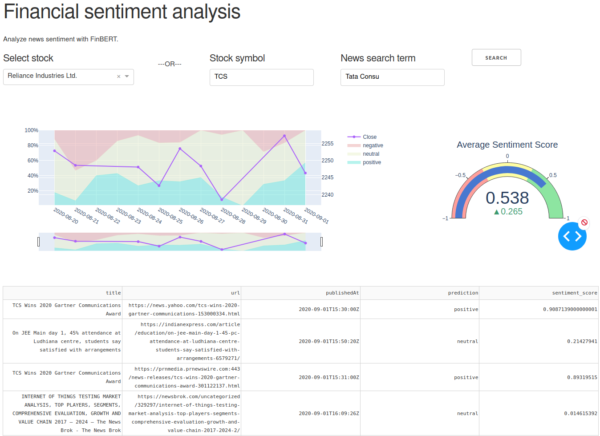
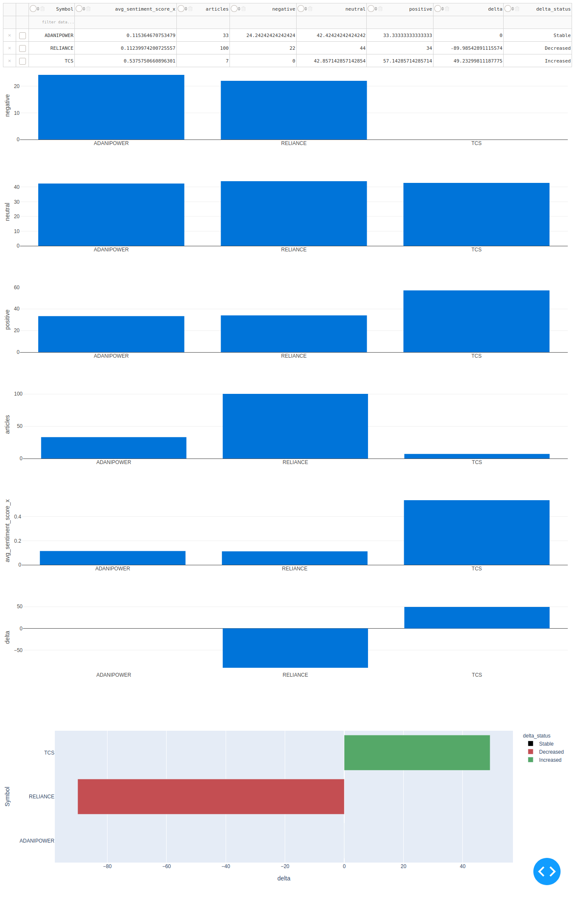

# Financial-Sentiment-Analysis

## Setup
0. Create a file `newsapi.key` and paste your news API key in the first line.

### Option A - conda
1. Install miniconda from https://docs.conda.io/en/latest/miniconda.html
2. Install dependencies `conda env create -f environment.yml` for conda or `conda create --name finbert --file requirements.txt`
3. Download model from [link](https://prosus-public.s3-eu-west-1.amazonaws.com/finbert/finbert-sentiment/pytorch_model.bin) and put it in default models directory `finbert/models/sentiment/base/`
4. Install nltk dependencies
```
import nltk
nltk.download('punkt')
```

### Option B - docker
1. `docker build -t finbert .`
2. `docker run -it --rm finbert:latest -p 8050:8050 -p 8051:8051`

## Run

1. `conda activate finbert`
2. `python3 main.py` Input date if manual else it'll fetch data for today.
3. `python3 app.py` for Dashboard.

Note : The terminal will output the url for each dashboard

### Screenshots



## Credits

Couldn't have done this without the [ProsusAI/finBERT](https://github.com/ProsusAI/finBERT) repo ofcourse.
```bibtex
@misc{1908.10063,
Author = {Dogu Araci},
Title = {FinBERT: Financial Sentiment Analysis with Pre-trained Language Models},
Year = {2019},
Eprint = {arXiv:1908.10063},
}
```